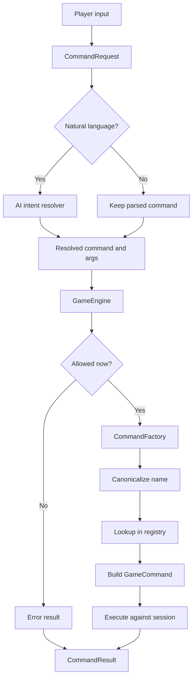

# Command execution

The command system is the core runtime boundary between player intent and game behavior. It takes parsed player input, decides which command object should run, and executes that command against the active session.

## Main entry points

- `SessionRequestDispatcher`: forwards in-game requests to the engine once the session is in `PLAYING`
- `GameEngine`: central runtime gate for command processing
- `CommandFactory`: resolves a `CommandRequest` into a `GameCommand`
- `CommandRegistry`: maps canonical command names to command creators
- `CommandDependencies`: dependency bag used to assemble concrete command objects

## Runtime flow

For a normal in-game request, the backend follows this shape:

1. `SessionRequestDispatcher` receives a `CommandRequest`.
2. Natural-language requests can be rewritten by `AiIntentResolver` into a concrete command plus arguments.
3. `GameEngine` checks that the session is active.
4. `GameEngine` applies global restrictions, including the dead-player command allowlist.
5. `CommandFactory` canonicalizes the command name and resolves the correct command creator from `CommandRegistry`.
6. The resulting `GameCommand` executes against the current `GameSession`.

This keeps the engine small while pushing feature-specific behavior into command packages and shared services.

## Why the registry matters

The registry is the scaling mechanism for command growth.

Instead of burying dispatch in one large switch statement, the codebase uses:

- command packages grouped by feature such as `move/`, `attack/`, `talk/`, `shop/`, `rest/`, and `quest/`
- creator definitions in the registry layer
- a shared dependency assembly path in `CommandFactory`

That split is useful because command parsing, command wiring, and gameplay logic are related but not identical concerns.

## Global rules owned by the engine

`GameEngine` is intentionally responsible for only a small number of cross-cutting checks:

- session must be in `PLAYING`
- the player action timestamp should be refreshed
- dead players can only use a restricted set of commands

Everything else should generally live in command implementations or the services they call.

## Change guidance

When adding or changing a command, treat these as separate concerns:

- how the command name is parsed and canonicalized
- how the command is constructed and wired
- what validation the command performs
- what reusable services should own the business rules

That boundary is especially important now that movement, combat, quests, shops, and social interactions all share the same command pipeline.