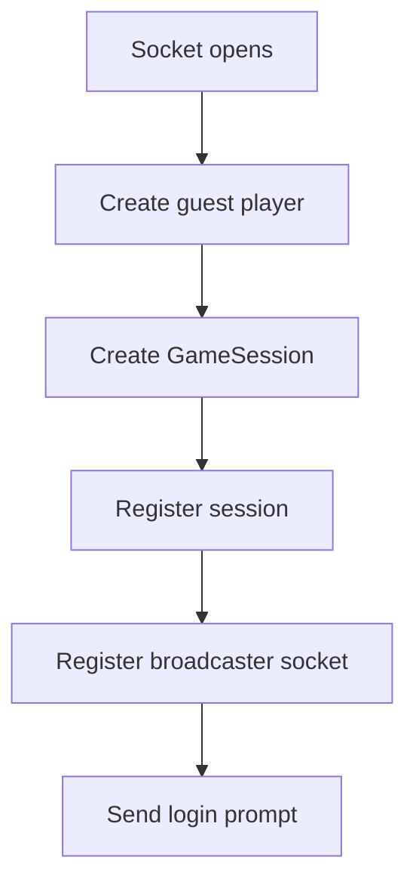
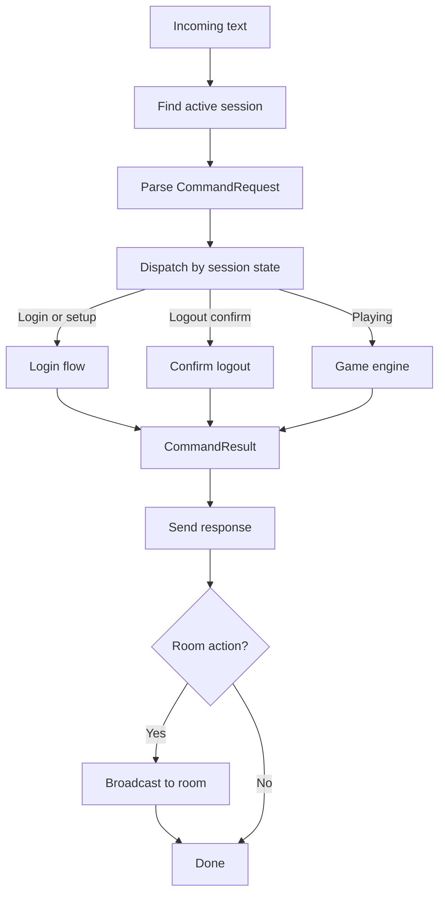

# Session and websocket flow

The backend entry point for a live player is the websocket layer. This is where the game creates sessions, routes requests, applies connection lifecycle rules, and decides what gets broadcast to the room.

## Main entry points

- `GameWebSocketHandler`: transport edge for connect, message handling, disconnect, and transport errors
- `GameSession`: mutable per-connection state, including player object and session state
- `GameSessionManager`: thread-safe registry for active sessions
- `SessionRequestDispatcher`: routes incoming requests based on session state before the command layer runs
- `SessionTerminationService`: centralizes disconnect persistence, party cleanup, reconnect replacement, and grace-period exit behavior

## Connection lifecycle

When a websocket connection opens:

1. The handler creates a guest `Player` anchored to the world's start room.
2. A `GameSession` is created for that websocket session id.
3. The session is registered in `GameSessionManager` and the socket is registered with the broadcaster.
4. The login flow sends the initial prompt back to the client.

That means a connection becomes a tracked game session before account or character login is complete.

## Message handling flow

Incoming text messages follow a predictable path:

1. `GameWebSocketHandler` finds the active `GameSession`.
2. The payload is deserialized into a `CommandRequest`.
3. `SessionRequestDispatcher` decides whether the request belongs to login, reconnect, logout confirmation, or normal in-game play.
4. If the player is already in `PLAYING`, the request goes to the game engine.
5. The resulting `CommandResult` is sent back to the originating socket.
6. Any room action attached to the result is broadcast to the appropriate nearby sessions.

The websocket layer is therefore not just a transport shell. It is also where room broadcasts, activity tracking, and state caching are coordinated.

## Session states matter

`SessionRequestDispatcher` uses session state as the top-level routing decision:

- `LOGOUT_CONFIRM`: accept only logout confirmation input
- non-`PLAYING` with reconnect token: attempt reconnect flow
- non-`PLAYING` without reconnect token: stay in login or character setup flow
- `PLAYING`: route into normal command processing

This boundary is important because login behavior and in-world behavior are intentionally separated before the command registry is involved.

## Disconnect behavior

Disconnect handling is more than removing the socket.

`GameWebSocketHandler` still owns socket registration and transport concerns, but it now hands normal session shutdown to `SessionTerminationService`.

That service centralizes:

- state cache persistence
- profile and inventory persistence for active players
- party departure updates
- delayed world-leave broadcast through the disconnect grace-period service
- inactivity timeout disconnect policy
- reconnect replacement teardown when a fresh session takes over an existing account connection

That grace-period behavior matters because browser refreshes and short reconnects should not look like full world exits.

## Why this is a cross-cutting system

Changes to session behavior often affect several layers at once:

- websocket transport
- session state machine
- login and reconnect rules
- room broadcast behavior
- persistence timing
- inactivity and disconnect handling

That is still cross-cutting by nature, but the fragile part is smaller now: termination policy lives in one service instead of being duplicated across the websocket handler, inactivity timeout flow, and reconnect replacement logic.

If one of those rules changes now, there is a single place to update the persistence and shutdown behavior before the surrounding layers delegate to it.