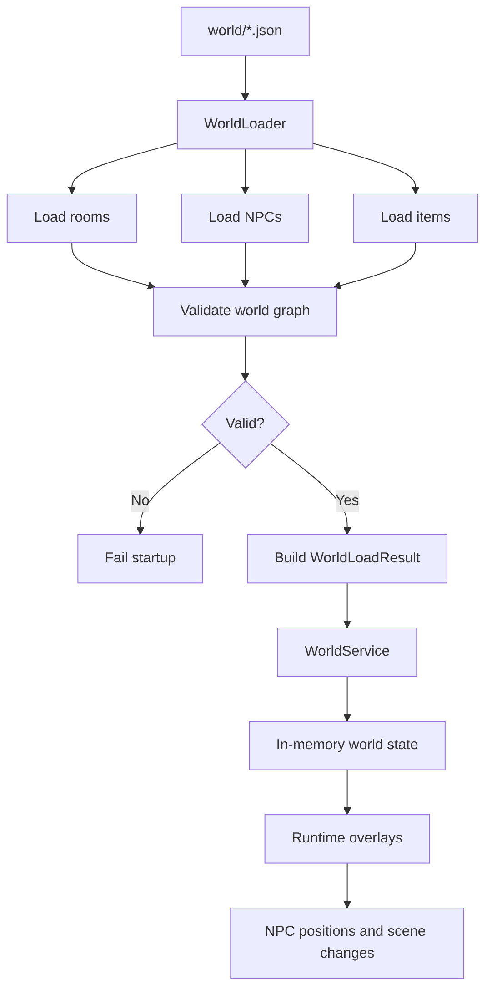

# World loading and runtime state

The world is not assembled manually in code. It is loaded from JSON resources, validated at startup, and then exposed through runtime services that can still apply temporary mutations while the server is live.

## Main entry points

- `WorldLoader`: reads rooms, NPCs, and items from classpath resources and validates them
- `WorldService`: owns the in-memory world registry used by the rest of the game
- `src/main/resources/world/`: source of truth for rooms, NPCs, items, and related content data

## Load pipeline

At startup, `WorldService` calls `WorldLoader.load()` and receives a `WorldLoadResult` containing:

- rooms
- NPC registry
- item registry
- NPC give-interaction definitions
- NPC room index
- start room id
- default recall room id

That load is fail-fast. Invalid references should stop the server rather than allowing a partially valid world.

## What gets validated

The loader currently checks more than just JSON syntax.

Examples include:

- duplicate room or NPC ids
- exits and hidden exits pointing to missing rooms
- missing start room or invalid recall configuration
- room references to unknown NPC or item ids
- invalid NPC combat configuration
- item and NPC give-interaction references that do not resolve

This is an important design choice: world data is treated as structured runtime configuration, not as loose content.

## Static data vs mutable runtime overlays

The loaded world is not perfectly static after startup.

`WorldService` also owns mutable runtime structures such as:

- live NPC registry state
- NPC room index
- scene overrides and scheduled scene resets
- persisted NPC positions

So there are really two layers:

- resource-backed definitions loaded from JSON
- runtime overlays that reflect the current live world

That distinction matters whenever a feature changes room content, NPC placement, or quest-driven world presentation.

## Documentation rule of thumb

If a behavior is meant to be authored by designers or changed without Java edits, it should be documented as part of the world-data contract.

If a behavior depends on runtime overlays, scheduled resets, or live service coordination, it should be documented as a backend runtime rule and not described as if it were purely static JSON.