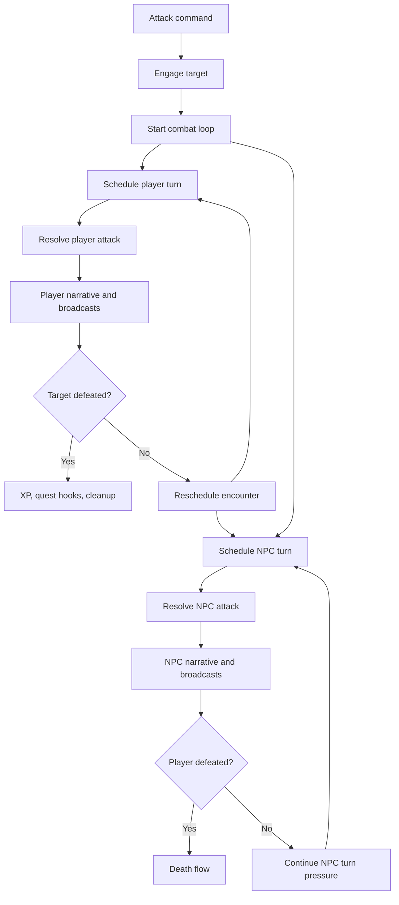

# Combat loop

Combat is a scheduled runtime system, not a one-off command response. An attack command can start the encounter, but the rest of the fight is driven by shared encounter state and scheduled player and NPC turns.

## Main pieces

- `CombatState`: tracks which sessions are in combat and which encounter is attached to each NPC target
- `CombatService`: resolves attack rules, damage, XP reward scaling, and quest hooks
- `CombatLoopScheduler`: schedules repeated player and NPC turns
- `PlayerDeathService` and `PlayerRespawnService`: own the death and recovery boundaries around combat
- `CombatNarrator`: builds descriptive combat text for the player

## State model

Combat state is split into two views:

- per-session engagement state so the backend knows which player is fighting
- per-NPC encounter state so multiple participants can share the same target encounter when appropriate

That split is what allows the backend to reason about both player-specific restrictions and target-specific encounter state.

## Loop behavior

Once combat starts, `CombatLoopScheduler` is responsible for continuing the encounter.

In broad terms it:

1. resolves the active encounter
2. schedules player turns
3. schedules NPC turns
4. sends player-facing narrative updates
5. broadcasts room-visible combat actions
6. applies death, XP, level-up, and quest side effects
7. stops or reschedules the loop based on the encounter result

This means combat timing is not owned by the command layer even though commands may initiate it.

## Important integrations

Combat currently touches several adjacent systems:

- quest progression for encounter-based objectives
- leveling and skill unlock announcements
- room broadcasts for nearby players
- death handling and respawn flow
- world lookups for room and target context

That makes combat one of the clearest examples of a cross-system gameplay runtime.

## Why documentation matters here

Combat behavior can drift if only one layer is changed.

Examples of risky partial changes:

- changing attack rules without updating scheduled loop behavior
- changing death behavior without updating combat cleanup
- changing XP rules without reviewing level-up and broadcast output
- changing encounter sharing without reviewing `CombatState`

The goal of this page is to keep the mental model stable even as the combat details continue to evolve.